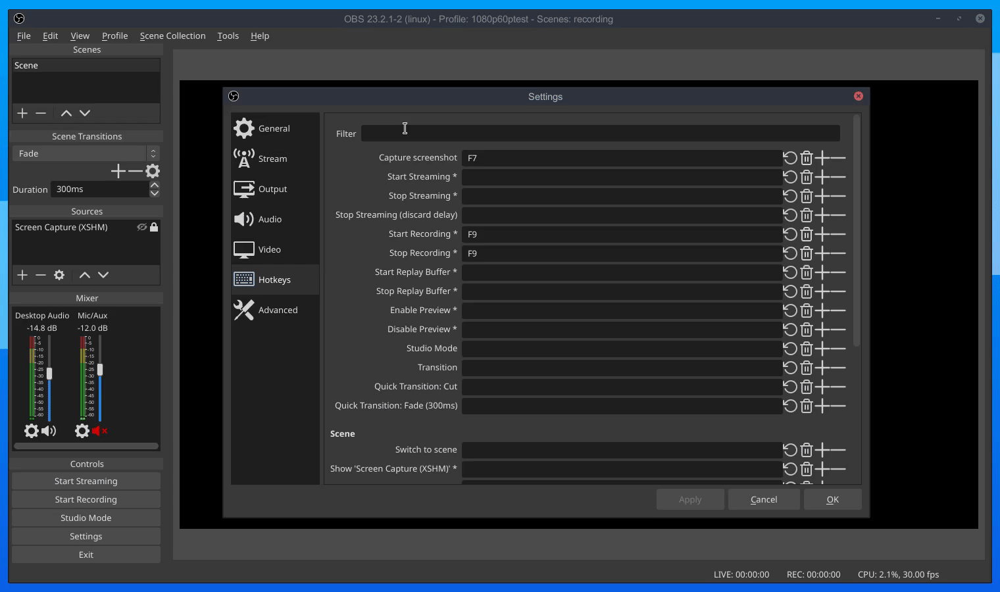

# scrab
**Scr**een gr**ab**
adds a configurable hotkey to quickly select a screen region and add it as an image source to the current scene

The plugin saves all screenshots into your home directory by default. If you wish to change that, open your obs-studio config
and edit it:

### Windows:
Open ``%appdata%\obs-studio\global.ini``
### Linux:
Open ``~/.config/obs-studio/global.ini``

Then add the following at the end of the file and replace ``{path}`` with whatever folder you want scrab to use for screenshots:
```ini
[scrab]
image_folder={path}
```

### Demonstration


### Credits
Screenshot sourcecode reused and slightly tweaked from [qTox](https://github.com/qTox/qTox) licensed under the GPL v3.0:
- [screenshotgrabber.cpp](https://github.com/qTox/qTox/blob/master/src/widget/tool/screenshotgrabber.cpp)
- [screenshotgrabber.h](https://github.com/qTox/qTox/blob/master/src/widget/tool/screenshotgrabber.h)
- [screengrabberoverlayitem.cpp](https://github.com/qTox/qTox/blob/master/src/widget/tool/screengrabberoverlayitem.cpp)
- [screengrabberoverlayitem.h](https://github.com/qTox/qTox/blob/master/src/widget/tool/screengrabberoverlayitem.h)
- [screengrabberchooserrectitem.cpp](https://github.com/qTox/qTox/blob/master/src/widget/tool/screengrabberchooserrectitem.cpp)
- [screengrabberchooserrectitem.h](https://github.com/qTox/qTox/blob/master/src/widget/tool/screengrabberchooserrectitem.h)
- [toolboxgraphicsitem.cpp](https://github.com/qTox/qTox/blob/master/src/widget/tool/toolboxgraphicsitem.cpp)
- [toolboxgraphicsitem.h](https://github.com/qTox/qTox/blob/master/src/widget/tool/toolboxgraphicsitem.h)
